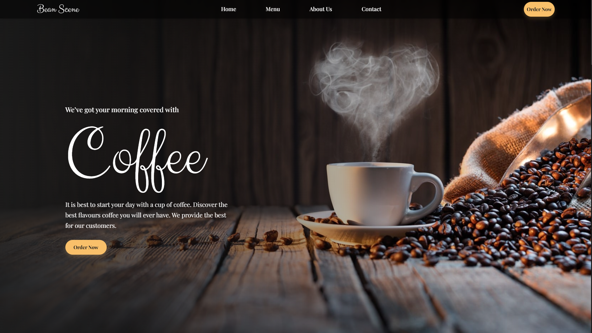

# AWS FS ABR25 D01 COMPASS - Coffee Shop

## Description

This project is a Coffee Shop application built using **JavaScript**, **HTML**, and **CSS**.

## Technologies Used

- **JavaScript**
- **HTML**
- **CSS**

## Tools and Libraries

- **Prettier**: For code formatting.
- **ESLint**: For code linting and quality assurance.

## Scripts

The following scripts are available in the project:

- `npm run start`: Builds the project and starts a local server using **live-server**.
- `npm run deploy`: Builds the project and deploys it to GitHub Pages.
- `npm run linttier`: Runs **ESLint** for code linting and formats the code using **Prettier**.
- `npm run dev`: Starts **live-server** in the root directory of the project on port 5500.

## How to Run

1. Clone the repository:

To use it, choose a folder where it will be cloned or a repository, open the terminal, and use the commands below:

```bash
git clone https://github.com/Zelchi/AWS_FS_ABR25_D01_COMPASS_Coffee-Shop.git
cd AWS_FS_ABR25_D01_COMPASS_Coffee-Shop
npm install
npm run start
```

2. Or access it via GitHub Pages: [Click here](https://zelchi.github.io/AWS_FS_ABR25_D01_COMPASS_Coffee-Shop)
